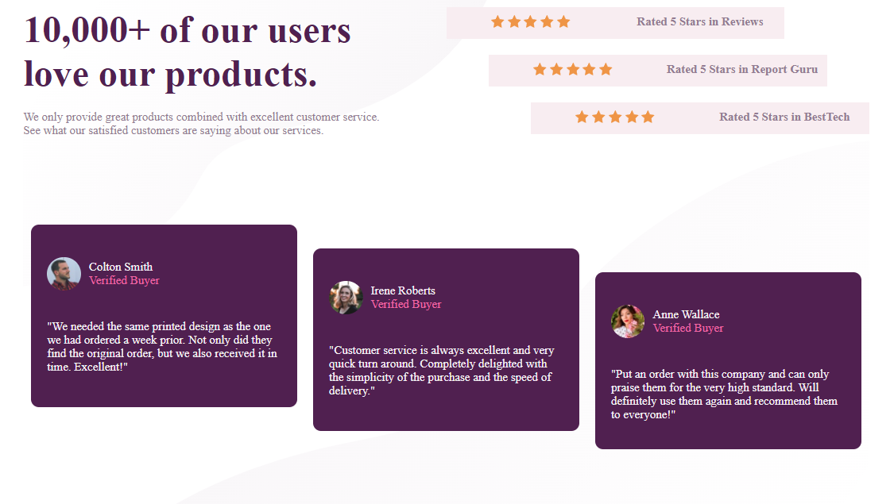
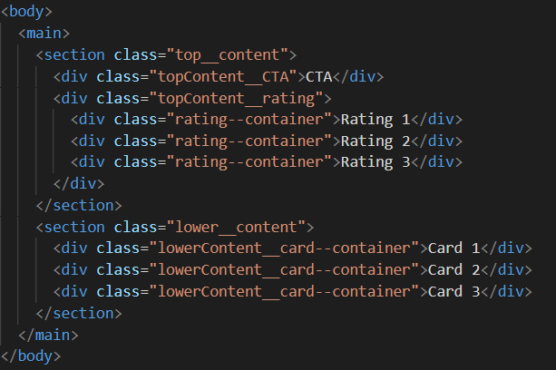

# Social Proof component with HTML & CSS

This is a solution to the [Social Proof component challenge on Frontend Mentor](https://www.frontendmentor.io/challenges/social-proof-section-6e0qTv_bA). Frontend Mentor challenges help you improve your coding skills by building realistic projects.

## Table of contents

- [The challenge](#the-challenge)
- [Links](#links)
- [Built with](#built-with)
- [What I learned](#what-i-learned)
- [Useful resources](#useful-resources)
- [Author](#author)

### The challenge

- Build out the project to the designs provided.

### Links

- [Live Site URL](https://jcsmileyjr.github.io/Social-Proof/)
- [Read the blog post](https://dev.to/jcsmileyjr/frontend-challenge-6-social-proof-component-25e)

### Built with

- Semantic HTML5 markup
- CSS custom properties
- Flexbox
- Mobile-first workflow

### What I learned

1. How to add multiple background images at one time
2. I was able to complete this project in a few hours by following a tried and true process:
* Design a responsive layout
* Build a foundation with HTML
* Add content
* Style with CSS, section by section
* End with functionality (JavaScript & CSS animation/transitions)

Below is code I'm proud of

### Useful resources

- [Tips on Background Images ](https://css-tricks.com/almanac/properties/b/background-image/) by CSS Tricks

## Author

- Website - [JC Smiley](https://www.jcsmileyjr.com)
- Frontend Mentor - [@jcsmileyjr](https://www.frontendmentor.io/profile/jcsmileyjr)
- Twitter - [@JCSmiley4](https://twitter.com/JCSmiley4)